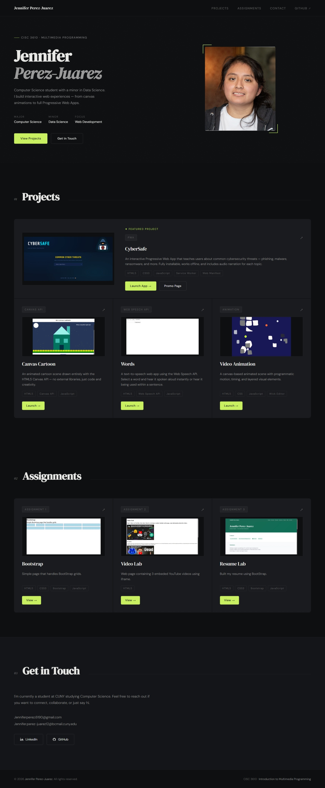

# CISC 3610 — Introduction to Multimedia Programming
### Jennifer Perez-Juarez

🔗 **[View Portfolio](https://jenpj234.github.io/CISC.-3610---Introduction-to-Multimedia-Programming/)**

---

---

## Projects

| Project | Description | Link |
|---|---|---|
| **CyberSafe PWA** | Interactive cybersecurity awareness app | [Launch](https://jenpj234.github.io/CISC.-3610---Introduction-to-Multimedia-Programming/CyberSafe/cyberSafe.html) |
| **Canvas Cartoon** | Animated scene using HTML5 Canvas API | [Launch](https://jenpj234.github.io/CISC.-3610---Introduction-to-Multimedia-Programming/Cartoons/cartoon.html) |
| **Words** | Text-to-speech app using Web Speech API | [Launch](https://jenpj234.github.io/CISC.-3610---Introduction-to-Multimedia-Programming/Words/dictionary.html) |
| **Video Animation** | Multi-layer animation made in Wick Editor | [View](https://jenpj234.github.io/CISC.-3610---Introduction-to-Multimedia-Programming/Video-Animation/animation.html) |

## Assignments

| Assignment | Link |
|---|---|
| Bootstrap | [View](https://jenpj234.github.io/CISC.-3610---Introduction-to-Multimedia-Programming/Assignments/bootstrap.html) |
| Video Lab | [View](https://jenpj234.github.io/CISC.-3610---Introduction-to-Multimedia-Programming/Assignments/videoLab.html) |
| Resume Lab | [View](https://jenpj234.github.io/CISC.-3610---Introduction-to-Multimedia-Programming/Assignments/resumeLab.html) |

---

Built with HTML5, CSS3, and JavaScript · CUNY 2026